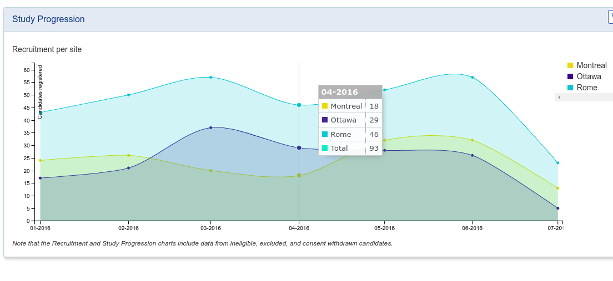
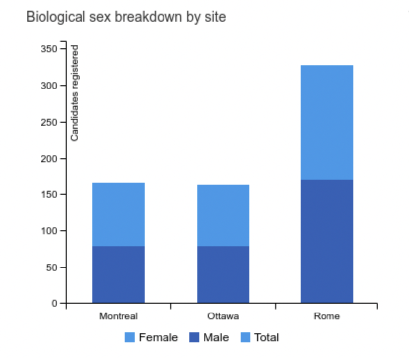
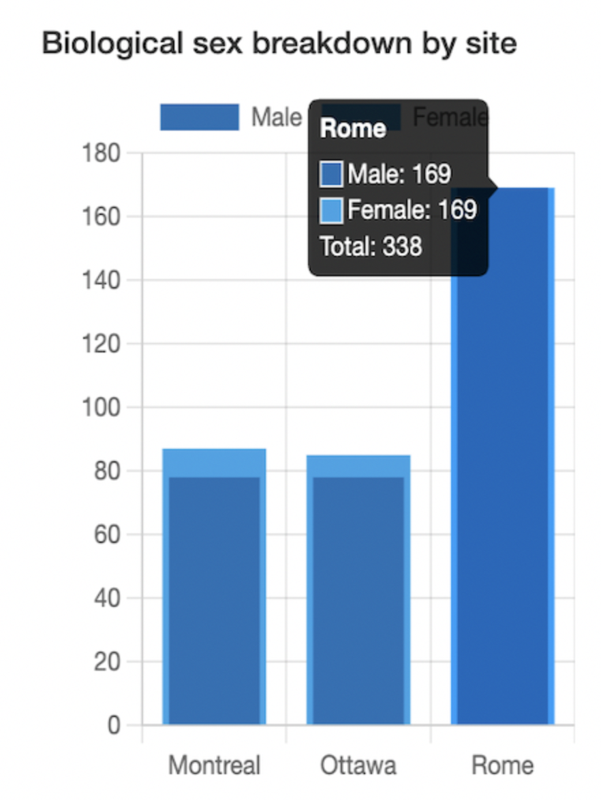
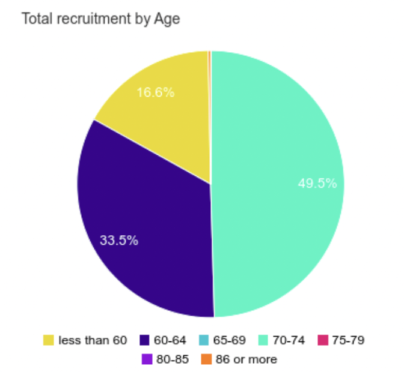

[Github](https://github.com/satvik-tha-god)

## Google Summer of Code 2022 Work Product Submission
_August 31, 2022_

#### Student

 
Satvik Singh

#### Organization
[INCF](https://www.incf.org/) -- International Neuroinformatics Coordinating Facility

#### Project Title
[LORIS](http://loris.ca/) Contribute to LORIS: Development of modules and API

#### Mentors
Christine Rogers, Rolando Acosta

### Project Description and Overview
The aim of this project is to contribute to the LORIS codebase in a general sense. This was a highy flexible goal that zeroed in on to improve the pre-exisiting or add new visualizations at the dashboard. Apart from that some secondary goals were to also improve the codebase by adding documentation and improving RB dataset.

#### Deliverables
The list of deliverables for this project were set as follows

1. Familiarization with LORIS codebase
2. Improvements to the pre-existing code and issues
3. Existing API and module bug fixes
4. Code or improve a feature and feature requests
5. Produce documentation about the changes and suggest changes
6. Refactor code after review

#### Timeline
##### May-June (Phase 1)
The first phase of the timeline was spent getting to know my mentors and organization, setting up my LORIS development environment and getting accustomed to the LORIS codebase and it's developer practices. It was also spent sending PRs related to documentation and a feature request. I have documented this phase in my [installation docs](https://docs.google.com/document/d/1jQgLcAe8jtR0fcNpp6PviUSJEwk8ohe9OwUDL-XlC5g/edit#heading=h.tbc3dftyfoi3). 

##### July (Phase 2)
The second phase of the timeline was spent by me working on the Dashboard module to improve visualisations by adding the Total tooltip to the Study Progression line charts, changing the Recruitment sex bar chart to stacked and adding Total and adding a Recruitment Age pie chart. I also sent improvements to RaisinBread and finally gave my mid-term presentation. 
 

##### August-Sept (Phase 3)
This phase was spent by me improving the previous PRs, me making the Recruitment Age pie chart completely dynamic and configurable and me working on a demonstration of my previously proposed idea to install and integrate Chart.js library to the LORIS codebase as an upgrade from the previously used libraries. It also included the LORIS core helping to merge my previous PRs to the main codebase. 

### Repository 
This is [my fork](https://github.com/satvik-tha-god/Loris) of the LORIS codebase. Can be used as reference for my work.

### Merged Pull Requests
This is the list of my [merged Pull Requests](https://github.com/aces/Loris/pulls?q=is%3Apr+author%3Asatvik-tha-god+is%3Amerged) from the timeline. The PRs will be expanded upon in more detail below.

### Open Pull Requests
This is the list of my [open Pull Requests](https://github.com/aces/Loris/pulls?q=is%3Apr+author%3Asatvik-tha-god+is%3Aopen) from the timeline. The PRs will be expanded upon in more detail below.  

### Visualisation PRs
1. [Visualising of Total in Study Progression Line Charts](https://github.com/aces/Loris/pull/8123)
2. [Updated Recruitment Bar Chart to Stacked and Add Total](https://github.com/aces/Loris/pull/8125)
3. [Added a Dynamic Candidate Pie Chart to Recruitment Dashboard](https://github.com/aces/Loris/pull/8134)
4. [Chart.js Integration with LORIS codebase](https://github.com/aces/Loris/pull/8163)

### General PRs
1. [Troubleshooting Documentation for lorisadmin account](https://github.com/aces/Loris/pull/8102)
2. [Field warnings for the Instrument Builder Module](https://github.com/aces/Loris/pull/8112)
3. [Fixed Inconsistent RaisinBread Data](https://github.com/aces/Loris/pull/8146)

### [Mid-term Presentation](https://docs.google.com/presentation/d/1fF7ZHcIpD1Y0gDhTJqOvjX1veF6dDzgSCsWcyaeq_l0/edit#slide=id.p)
I presented my work to the LORIS development team on 2nd August. I presented my journey and the progress I had made in my project at that point over the timeline. I discussed the current state of visualisations and LORIS codebase and gave suggestions to the possible directions that LORIS could go in.

### Experience
The whole timeline of Google Summer of Code was really great for me. I learned a lot in terms of new technologies such as PHP, learned the organisational workflow and how to collaborate better. The tasks were challenging and interesting and made me go outside of my comfort zone. The experience of working at LORIS for me was an extremely valuable and memorable one and will help me a lot in my career as a developer and engineer. 

I would like to thank my mentors Rolando and Christine for being so helpful, providing guidance, easy to communicate with and having enough patience to see me through the project, and also the LORIS development team for their insights and help!
